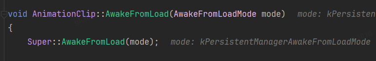
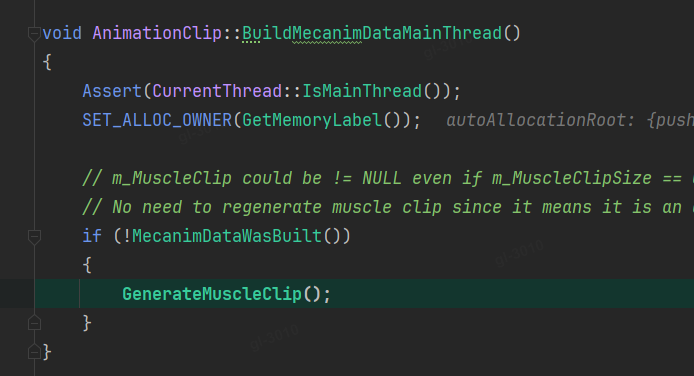
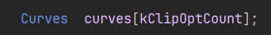
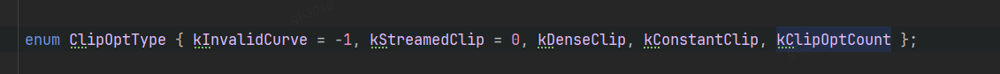
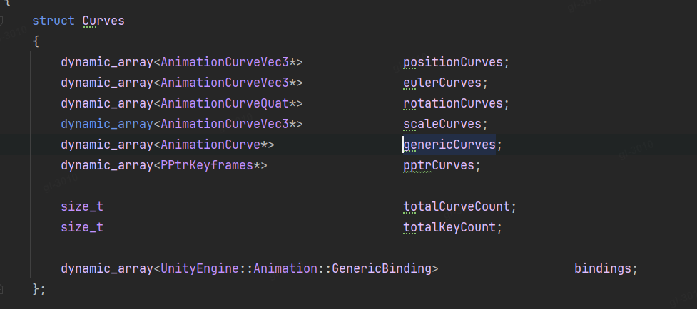
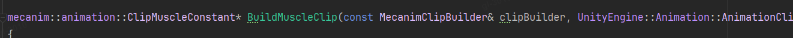
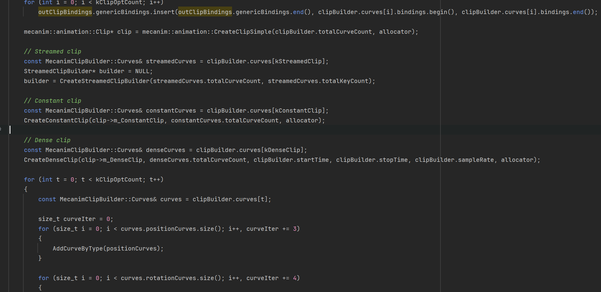

# Animator的Clip数据缓存

## ClipMuscleConstant

Script：clipmuscle.cpp

功能：用于存储runtime时候的Clip的数据，从序列化数据加载到内存对象中

### 流程

#### * 构建MecanimClipBuilder clipBuilder

一般在动画的导入的时候，或者load的时候会去调用

构建MecanimClipBuilder clipBuilder，

遍历m_FloatCurves、m_PositionCurves、m_QuaternionCurves、m_EulerCurves、m_ScaleCurves，存到MecanimClipBuilder中，

并且，按照3种类型的curve进行缓存。

**并且每一个curve构建一个GenericBinding**。

所以是大类，

每个都会细分

#### * 构建ClipMuscleConstant

将所有的gengericbinding存到outClipBindings。

然后在allocator上创建一个clip，在将

只有steamed clip 创建一个临时的builder
