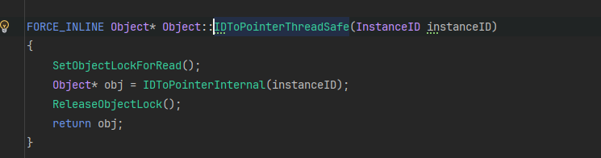

# # Unity InstanceId 问题

## 问题

因为job的complete放在了update最后，不能保证中间是否会插入新的Object对象，导致奔溃

这里有个PPtr指针的解引用操作，这个操作都是非线程安全的

## 需求：

了解通过instanceid访问对象是否是线程安全的

## 结论：

1. InstanceId是如何创建的,是否线程安全

InstanceId 增减是线程安全，根据条件加入到PointerMap中，且unity自己有多线程创建对象的例子

2.运行时是如何通过InstanceId去拿到对象的,是否线程安全

PointerMap中find操作（根据InstanceId）是线程不安全的，除非确保在此阶段没有Unity对象创建，

或者使用Unity的读写锁。

## 问题：

2. InstanceId是如何创建的,是否线程安全
3. 运行时是如何通过InstanceId去拿到对象的,是否线程安全

### 问题1：InstanceId是如何创建的

看代码赋值的地方有3处

##### 1.在AllocateAndAssignInstanceID阶段，通过调用AllocateNextLowestInstanceID获取新的InstanceId

再看AllocateNextLowestInstanceID的实现

通过原子操作来获取一个新的InstanceId值，保证即使在多线程情况下得到的Id也是唯一的

##### 2.在AllocateAndAssignInstanceIDNoLock，也是通过调用AllocateNextLowestInstanceID获取新的InstanceId

然后看调用堆栈

发现实际上Unity允许在多线程情况下创建Object对象。

且unity自己也有不少在多线程下创建的对象在使用，且有相关的单元测试

大多用于临时对象

##### 3.在Object::Produce内，通过传入的InstanceId进行创建

这个在前面的堆栈就展示过了

##### 从上面这些来看InstanceId的数值是线程安全的，不会有InstanceId重复。

#### 接下来就是看InstanceId注册到IDToPointer这个Map的过程是否线程安全

1.看函数InsertObjectInMap部分

ms_IDToPointer是一个key为InstanceId,value为Object指针的map

ms_IDToPointer 会在插入的时候判断是否容量不足，进行扩容，扩容会有内存拷贝操作，会把之前存放Uobject*的内存块拷贝到新分配的内存块上面去。

###### 所以如果中间有插入,且没有触发扩容的情况下，其实还是安全的，因为instanceid唯一。所以就是看find的时候扩容了是否安全。

### 2.运行时是如何通过InstanceId去拿到对象的

就在Object::IDToPointerInternal内

根据上面描述的可知，需要关注的就是扩容时候的处理，理论上是容器内没有原子操作或者加锁

m_nodes里面存的对应的对象，resize重新分配和赋值的也是这个，所以在其他线程中find，并且在此阶段中有主线程在创建unity对象，同时之前free的内存又立马被用了并且赋上了其他数值，那这时候通过instanceid去解引用拿到的unityobject是必然不对的。

剩下就是看上层是否加锁，也就是说在find的时候是否lock了，不会让其他对象添加到ms_IDToPointer，当find的操作完成之后，在加入到ms_IDToPointer中。

查看代码：

Object::RegisterInstanceID中，加了读写锁

在Object::RegisterInstanceIDNoLock中则没有锁

在Object::AllocateAndAssignInstanceID的时候，也是正常加了读写锁了

然后看读写锁的代码

readLock方法允许多个线程同时获取该锁，以进行并发读取操作。如果当前已有一个写锁或其他线程正在请求写锁，则读锁会被阻塞，直到所有写锁请求完成并释放锁为止。读锁和写锁之间是互斥的。

writeLock方法只允许一个线程获取该锁，以进行写入操作。如果当前已有一个读锁或其他线程正在请求读锁，则写锁会被阻塞，直到所有读锁请求完成并释放锁为止。写锁是独占的，同一时间只能有一个线程持有写锁。

而我们的接口，只要是通过GetSafe的方式拿

其实内部加了读写锁的

所有只有加了相关读写锁的情况下，才是安全的。
